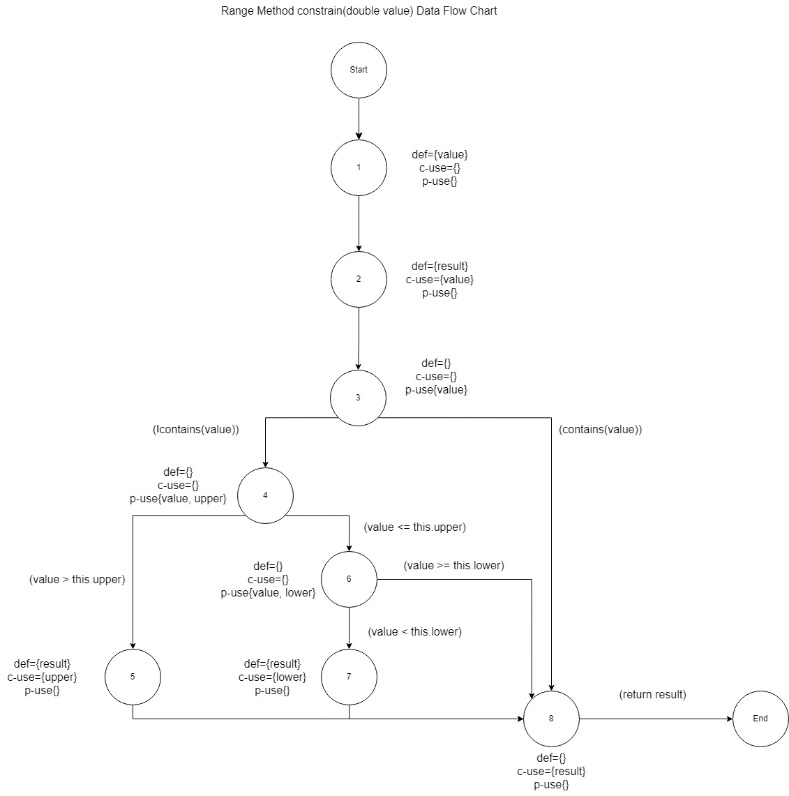

**SENG 438 - Software Testing, Reliability, and Quality**

**Lab. Report #3 – Code Coverage, Adequacy Criteria and Test Case Correlation**

| Group: 08      |
|-----------------|
| Student 1: Sufyan Ayaz                |   
| Student 2: Muhammad Haris Kashif              |   
| Student 3: Faisal Islam               |   
| Student 4: Taha Khan                |

(Note that some labs require individual reports while others require one report
for each group. Please see each lab document for details.)

# 1 Introduction

In this lab we were given the task of expanding our test suite for two classes from the JFreeChart framework (our SUT), Range (org.jfree.data.Range), and DataUtilities (org.jfree.data.DataUtilities). The purpose of this lab is to implement and familiarize ourselves with white-box testing methodologies using coverage tools. The tool that we chose to use was EclEmma, as it was the recommended tool, and it is already built into Eclipse. This lab allowed us to find all the edge cases, methods, statements, and branches that we missed in our original test suite from the previous lab. 

# 2 Manual data-flow coverage calculations for calculateColumnTotal() and constrain() methods

## DataUtilities Class Data-Flow Coverage: calculateColumnTotal(Values2D data, int column) Method

### Data Flow Graph


### The Def-Use Sets per Statement

| Node | Statement                                        | Def     | C-Use           | P-Use          |
|------|--------------------------------------------------|---------|-----------------|----------------|
| 1    | public static double calculateColumnTotal(Values2D data, int column) | {data, column} | {} | {} |
| 2    | ParamChecks.nullNotPermitted(data, "data"); | {} | {} | {data} |
| 3    | double total = 0.0; | {total} | {} | {} |
| 4    | int rowCount = data.getRowCount(); | {rowCount} | {data} | {} |
| 5    | for (int r = 0; r < rowCount; r++) | {r} | {r} | {r, rowCount} |
| 6    | Number n = data.getValue(r, column); | {n} | {data, r, column} | {} |
| 7    | if (n != null) | {} | {} | {n} |
| 8    | total += n.doubleValue(); | {total} | {total, n} | {} |
| 9    | for (int r2 = 0; r2 > rowCount; r2++) | {r2} | {r2} | {r2, rowCount} |
| 10   | Number n = data.getValue(r2, column); | {n} | {data, r2, column} | {} |
| 11   | if (n != null) | {} | {} | {n} |
| 12   | total += n.doubleValue(); | {total} | {total, n} | {} |
| 13   | return total; | {} | {total} | {} |


### List of all DU-Pairs per Variable

| Variable | Node(s) Defined | Node(s) Used       | DU Pairs |
|----------|-----------------|--------------------|----------|
| data | 1 | {2, 4, 6, 10} | ({1, 2}, {1, 4}, {1, 6}, {1, 10}) |
| column | 1 | {6, 10} | ({1, 6}, {1, 10}) |
| total | {3, 8, 12} | {8, 12, 13} | ({3, 8}, {3, 12}, {3, 13}, {8, 8}, {8, 12}, {8, 13}, {12, 12}, {12, 13}) |
| rowCount | 4 | {5, 9} | ({4, 5}, {4, 9}) |
| r  | 5 | {5, 6} | ({5, 5}, {5, 6}) |
| n | {6, 10} | {7, 8, 11, 12} | ({6, 7}, {6, 8}, {10, 11}, {10, 12}) |
| r2 | 9 | {9, 10} | ({9, 9}, {9, 10}) |


### Test Cases and the DU-Pairs They Cover

| Test Case Name | Set of DU Pairs Covered By Test |
|----------------|---------------------------------|
| calculateColumnTotalForTwoValues() | ({1, 2}, {1, 4}, {1, 6}, {3, 8}, {8, 8}, {8, 13}, {4, 5}, {4, 9}, {5, 5}, {5, 6}, {6, 7}, {6, 8}, {9, 9}) |
| calculateColumnTotal_positiveValues() | ({1, 2}, {1, 4}, {1, 6}, {3, 8}, {8, 8}, {8, 13}, {4, 5}, {4, 9}, {5, 5}, {5, 6}, {6, 7}, {6, 8}, {9, 9}) |
| calculateColumnTotal_negativeValues() | ({1, 2}, {1, 4}, {1, 6}, {3, 8}, {8, 8}, {8, 13}, {4, 5}, {4, 9}, {5, 5}, {5, 6}, {6, 7}, {6, 8}, {9, 9}) |
| calculateColumnTotal_mixedValues() | ({1, 2}, {1, 4}, {1, 6}, {3, 8}, {8, 8}, {8, 13}, {4, 5}, {4, 9}, {5, 5}, {5, 6}, {6, 7}, {6, 8}, {9, 9}) |
| calculateColumnTotal_zeroValues() | ({1, 2}, {1, 4}, {1, 6}, {3, 8}, {8, 8}, {8, 13}, {4, 5}, {4, 9}, {5, 5}, {5, 6}, {6, 7}, {6, 8}, {9, 9}) |
| calculateColumnTotal_singleValue() | ({1, 2}, {1, 4}, {1, 6}, {3, 8}, {8, 13}, {4, 5}, {4, 9}, {6, 7}, {6, 8}, {9, 9}) |
| calculateColumnTotal_emptyValues2D() | ({1, 2}, {1, 4}, {3, 13}, {4, 5}, {4, 9}, {5, 5}, {9, 9}) |
| calculateColumnTotal_NaNValues() | ({1, 2}, {1, 4}, {1, 6}, {3, 13}, {4, 5}, {4, 9}, {5, 5}, {5, 6}, {6, 7}, {9, 9}) |
| calculateColumnTotal_largeValues() | ({1, 2}, {1, 4}, {1, 6}, {3, 8}, {8, 8}, {8, 13}, {4, 5}, {4, 9}, {5, 5}, {5, 6}, {6, 7}, {6, 8}, {9, 9}) |
| calculateColumnTotal_infinityValues() | ({1, 2}, {1, 4}, {1, 6}, {3, 8}, {8, 8}, {8, 13}, {4, 5}, {4, 9}, {5, 5}, {5, 6}, {6, 7}, {6, 8}, {9, 9}) |


### DU-Pair Coverage Calculation

23 pairs. Before displaying the calculations for DU-Pair coverage, we would like to point out that of the 24 DU-Pairs, 9 pairs would never be covered. This lack of coverage is due to a flaw in the logic of the second for loop in the calculateColumnTotal method, which makes it redundant, and not due to a lack of proper test cases being written. In order to have reached the code inside the second for loop, and cover the 9 missing DU-Pairs, the method would have to be re-written and the logic would have to be fixed. Therefore, the following 9 DU-Pairs are impossible to cover with the method written as it currently is, and can therefore be disregarded from the coverage calculation without consequence: 

- data: {1, 10}
- column: {1, 10}
- total: {3, 12}, {8, 12}, {12, 12}, {12, 13}
- n: {10, 11}, {10, 12}
- r2: {9, 10}

After disgarding the redundant DU-Pairs, we can use the remaining pairs to calculate the DU_Pair coverage as follows:

> DU-Pair Coverage = (Number of DU Pairs Covered / Total Number of DU Pairs Found) * 100% = (15 / 15) * 100% = 100%

As it can be see by the calculation stated above, the constrain(double value) method from the Range class has 100% coverage of the DU-Pairs associated with it.


## Range Class Data-Flow Coverage: constrain(double value) Method

### Data Flow Graph



### The Def-Use Sets per Statement

| Node | Statement                      | Def     | C-Use        | P-Use        |
|------|--------------------------------|---------|--------------|--------------|
| 1    | public double constrain(double value) | {value} | {} | {} |
| 2    | double result = value;         | {result} | {value} | {} |
| 3    | if (!contains(value))          | {} | {} | {value} |
| 4    | if (value > this.upper)        | {} | {} | {value, upper} |
| 5    | result = this.upper;           | {result} | {upper} | {} |
| 6    | else if (value < this.lower)   | {} | {} | {value, lower} |
| 7    | result = this.lower;           | {result} | {lower} | {} |
| 8    | return result;                 | {} | {result} | {} |


### List of all DU-Pairs per Variable

| Variable | Node(s) Defined | Node(s) Used | DU Pairs |
|----------|-----------------|--------------|----------|
| value    | 1 | {2, 3, 4, 6} | ({1, 2}, {1, 3}, {1, 4}, {1, 6}) |
| result   | {2, 5, 7} | 8 | ({2, 8}, {5, 8}, {7, 8}) |


### Test Cases and the DU-Pairs They Cover

| Test Case Name | Set of DU Pairs Covered By Test |
|----------------|---------------------------------|
| constrainedValueFoundInRange() | ({1, 2}, {1, 3}, {2, 8}) |
| constrainedValueFoundWhenValueEqualsUpperBound() | ({1, 2}, {1, 3}, {2, 8}) |
| constrainedValueFoundWhenValueEqualsLowerBound() | ({1, 2}, {1, 3}, {2, 8}) |
| constrainedValueFoundWhenValueGreaterThanUpperBound() | ({1, 2}, {1, 3}, {1, 4}, {5, 8}) |
| constrainedValueFoundWhenValueIsWayLargerThanUpperBound() | ({1, 2}, {1, 3}, {1, 4}, {5, 8}) |
| constrainedValueFoundWhenValueLessThanLowerBound() | ({1, 2}, {1, 3}, {1, 4}, {1, 6}, {7, 8}) |
| constrainedValueFoundWhenValueIsWayLowerThanLowerBound() | ({1, 2}, {1, 3}, {1, 4}, {1, 6}, {7, 8}) |
| constrainedValueNotFoundWhenValueIsNaN() | ({1, 2}, {1, 3}, {1, 4}, {1, 6}, {2, 8}) |


### DU-Pair Coverage Calculation

The DU-Pair coverage is calculated as follows:

> DU-Pair Coverage = (Number of DU Pairs Covered / Total Number of DU Pairs Found) * 100% = (7 / 7) * 100% = 100%

As it can be see by the calculation stated above, the calculateColumnTotal(Values2D data, int column) method from the DataUtilities class has 100% coverage of the DU-Pairs associated with it.

# 3 A detailed description of the testing strategy for the new unit test

Text…

# 4 A high level description of five selected test cases you have designed using coverage information, and how they have increased code coverage

## combineIgnoringNaNAndNull()
```java
    @Test
    public void combineIgnoringNaNAndNull() {
    	double nan = Double.NaN;
    	Range range1 = new Range(nan, nan);
    	Range range2 = null;
    	Range range3 = Range.combineIgnoringNaN(range1, range2);
    	assertEquals("Range should just be null", null, range3);
    }
```
For this test case we defined the first range as a NaN range and the second as a null range so that the case where range2 is null and range1 is a NaN range would be covered, so that the return null statement in the nested conditional would be reached. This in turn increased our Statement and Branch coverage. 

## testEqualsWithUnequalUpperBound()
```java
    @Test
    public void testEqualsWithUnequalUpperBound() {
        Range range1 = new Range(0.0, 10.0);
        Range range2 = new Range(0.0, 5.0); // Different upper bound
        boolean eq = range1.equals(range2);
        assertFalse("Range 1 and Range 2 are not equal", eq);
    }
```
For this test cased we defined range1 and range2 with the same lower bounds but different upper bounds so that the case where range1 and range2 have the same lower bound but different upper bounds is not equal would be covered, so that the second conditional and its body pertaining to the upper bounds would execute after skipping the first conditional pertaining to the lower bounds. This in turn increased our Statement and Branch Coverage.

## testCloneValues()
```java
    @Test
    public void testCloneValues() {
        // Testing that cloned array has the same values as the original array
        double[][] original = {{1.0, 2.0, 3.0}, {4.0, 5.0, 6.0}};
        double[][] cloned = DataUtilities.clone(original);
        for (int i = 0; i < original.length; i++) {
            assertArrayEquals(original[i], cloned[i], 0.0);
        }
    }
```
For this test case, we defined 2D arrays called original and cloned, and populated the original array with values. Then, we used the DataUtilities.clone() method to create a cloned array. The test ensures that the cloned array has the same values as the original array by iterating through each row and using assertArrayEquals() to compare corresponding rows of both arrays. This increased both, our branch coverage and statement coverage.

## testEqual_DifferentValues()
```java
    // Test for checking inequality when arrays have different values.
    @Test
    public void testEqual_DifferentValues() {
        double[][] a = new double[][] { { 1.0, 2.0 }, { 3.0, 4.0 } };
        double[][] b = new double[][] { { 1.0, 2.0 }, { 3.0, 5.0 } };
        assertFalse(DataUtilities.equal(a, b));
    }
```
For this test case, we're examining inequality when arrays have different values. We've defined two 2D arrays, 'a' and 'b', with different values in the second row of array 'b'. The test verifies that the equal() method returns false when comparing these two arrays. This ensures that the method correctly identifies inequality between arrays by comparing corresponding elements. Consequently, this test contributes to enhancing the statement and branch coverage by validating the behavior of the method in scenarios where arrays differ in values.

## calculateColumnTotalForTwoValues_ValidRows()
```java
    @Test
    public void calculateColumnTotalForTwoValues_ValidRows() {
        // Testing the calculation of column total for two valid rows
        int[] validRows = {0,1};
        mockingContext.checking(new Expectations() {
            {
                one(values).getRowCount();
                will(returnValue(2));
                one(values).getValue(0, 0);
                will(returnValue(7.5));
                one(values).getValue(1, 0);
                will(returnValue(2.5));
            }
        });
        double result = DataUtilities.calculateColumnTotal(values, 0, validRows);
        assertEquals(result, 10.0, .000000001d);
    }
```
In the calculateColumnTotalForTwoValues_ValidRows() test, we verify the method's ability to accurately compute the column total for two specified rows. Using a mocking context, we simulate interactions with a data structure called 'values', retrieving specific values for the given rows and column index. The method then sums these values to calculate the total for the specified column. We expect the total to be 10.0 and verify this result with a precision of .000000001d. This test ensures the method performs correctly, contributing to an increase of branch coverage and statement coverage.


# 5 A detailed report of the coverage achieved of each class and method (a screen shot from the code cover results in green and red color would suffice)

## Range Class

### Statement/Line Coverage


### Branch Coverage


### Method (Condition) Coverage


## DataUtilities Class

### Statement/Line Coverage


### Branch Coverage


### Method (Condition) Coverage


# 6 Pros and Cons of coverage tools used and Metrics you report

Our group chose to use EclEmma for this assignment. There were a few pros we noticed while using EclEmma, with the main one being that it seamlessly integrates into the Eclipse IDE, letting us work in a familiar environment for code analysis without requiring additional setup. EclEmma itself also provided a user-friendly interface, which allowed us to easily navigate through code coverage reports and analyze the results. EclEmma also supports multiple coverage metrics, including statement coverage, branch coverage, and condition coverage, which provided comprehensive insights into the quality of tests.

The one main disadvantage was that it was a little difficult to navigate through EclEmma at first. A lot of features that was required for us were hidden in subtabs and were hard to find at first. This was an issue when we were trying to change the type of coverage we were looking for,

We reported three coverage metrics in our report. Statement coverage evaluates whether each line of code has been executed at least once during the testing process. Branch coverage indicates the percentage of branches in the code that have been covered by the test cases. Meanwhile, method coverage evaluates whether each method or function defined in the source code has been covered during the testing process.

# 7 A comparison on the advantages and disadvantages of requirements-based test generation and coverage-based test generation.

Requirements-based testing is a black box testing methodology that can be easier to implement and follow compared to other testing methodologies because designing tests and writing test cases is based purely on the outlined requirements of the software, rather than really understanding the software and the source code in depth, only a (relatively) surface level understanding is necessary. It ensures that the requirements of the client are met, and allows for early detection of bugs, and streamlines communication between developers, testers, and stakeholders. It also simplifies time management by assisting in estimating how long it will take to test the software and how many test cases need to be developed. One of the detriments of requirements-based testing though is the fact that focusing on requirements creates the potential for missing and overlooking edge cases and other important parts of the software that aren’t defined explicitly in the requirements. It creates the potential for a kind of “placebo effect” where developers and testers think their software is sound and functional, when in reality it is lacking fundamental features. 

Coverage-based testing is a white box testing methodology that is more tedious to implement compared to requirements-based testing, but it tests all parts of the code in an SUT, rather than focusing on a single set of requirements . Looking for coverage instead of requirements ensures that all cases and parts of the code are reached, especially with different types of coverage such as statement coverage or branch coverage. It ensures that the testing comprises all parts of the code, rather than focusing on a single part or requirement, and it ensures a higher quality product is provided to the client, which also improves the code’s maintainability in the future by mitigating future bugs that can lead to an unreliable system. One of the drawbacks of this methodology is that it does not prevent bugs that may be present in certain edge cases still, as while the code may have a high coverage metric, it may still have bugs present, because rather than focusing on more complex scenarios, the testing only focused on if parts of the code have been covered or not. Another disadvantage that we encountered is the creation of redundant test cases that aren’t testing the software effectively, rather they are present merely to increase coverage and provide a false sense of security in that the software is well developed. 


# 8 A discussion on how the team work/effort was divided and managed

Text…

# 9 Any difficulties encountered, challenges overcome, and lessons learned from performing the lab

Text…

# 10 Comments/feedback on the lab itself

Sufyan: Overall, I felt that this lab was a great introduction to coverage testing and how important it is when developing software. The lab made it very easy to aclimate to the new EclEmma technology, and was very helpful in allowing me to understand white-box testing through its hands-on approach. Coverage was something I had never considered when debugging/testing code in the past, and so it was very useful with helping me understand how to create full-coverage tests in an intuitive and easy-to-understand way. 

Faisal: Overall I enjoyed this lab and it was easy to follow along and understand what to do thanks to the well written documentation. The lab was a good introduction to the concept of white box testing using a coverage tool like EclEmma and I found using it to be really helpful and intuitive, pointing out what lines of code or what branches in particular we were missing, so that we could write test cases for them to increase our coverage. I enjoyed increasing our test suite's coverage and I found it really fulfilling and satisfying to gradually improve our suite's coverage from its initial incredibly poor coverage. Coverage is a new concept that I will definitely consider when both testing, designing and developing software in the future. 
